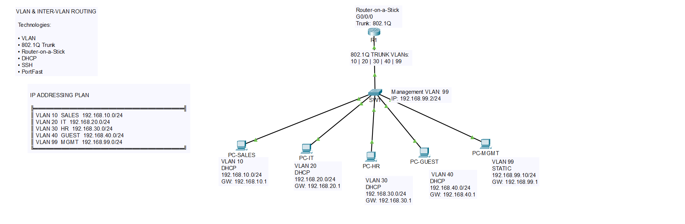

# VLAN & Inter-VLAN Routing Lab

## 📌 Overview

This project demonstrates a small enterprise network using Cisco Router-on-a-Stick architecture.

The network is segmented into multiple VLANs and provides Inter-VLAN communication through a Cisco router.

## 🛠️ Technologies

- VLAN
- 802.1Q Trunking
- Router-on-a-Stick
- DHCP
- SSH
- Management VLAN
- STP PortFast


## 🗺️ Network Topology



## 🌐 VLAN & IP Addressing

- VLAN 10 - SALES
  - Network: 192.168.10.0/24
  - Gateway: 192.168.10.1

- VLAN 20 - IT
  - Network: 192.168.20.0/24
  - Gateway: 192.168.20.1

- VLAN 30 - HR
  - Network: 192.168.30.0/24
  - Gateway: 192.168.30.1

- VLAN 40 - GUEST
  - Network: 192.168.40.0/24
  - Gateway: 192.168.40.1

- VLAN 99 - MGMT
  - Network: 192.168.99.0/24
  - Gateway: 192.168.99.1

## 💻 Devices

- 1 × Cisco Router
- 1 × Cisco Layer 2 Switch
- 5 × PCs

## 🔐 Management

SW1 Management IP:

```text
192.168.99.2/24
```

SSH is configured for secure remote management.

## 📡 DHCP

DHCP is provided by R1 for:

- VLAN 10 - SALES
- VLAN 20 - IT
- VLAN 30 - HR
- VLAN 40 - GUEST

## 🧪 Verification

The following tests were successfully performed:

- VLAN verification
- 802.1Q trunk verification
- DHCP address assignment
- Gateway connectivity
- Inter-VLAN connectivity
- Management VLAN connectivity
- SSH access to SW1

## 📁 Project Files

- `vlan-intervlan.pkt` - Cisco Packet Tracer project
- `topology.png` - Network topology
- `screenshots/` - Verification screenshots
- `README.md` - Project documentation

## 🎯 Lab Objective

The objective of this lab is to demonstrate practical knowledge of Layer 2 switching, VLAN segmentation, Inter-VLAN Routing, DHCP and secure network device management.
