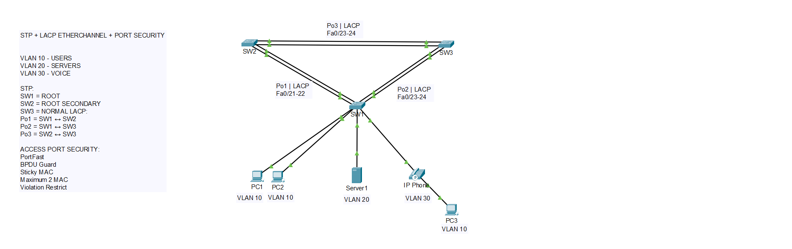

# STP + LACP EtherChannel + Port Security Lab

## 📌 Overview

This project demonstrates Layer 2 switching concepts using Cisco switches.

The lab focuses on Spanning Tree Protocol, LACP EtherChannel, VLAN trunking, and Layer 2 security features.

## 🗺️ Network Topology



## 🏗️ Topology

The lab consists of three Cisco Layer 2 switches connected in a redundant topology.

* SW1 - STP Root Bridge
* SW2 - STP Secondary Root
* SW3 - Normal Switch

Three LACP EtherChannels are configured:

* Po1 - SW1 ↔ SW2
* Po2 - SW1 ↔ SW3
* Po3 - SW2 ↔ SW3

## 🌐 VLANs

* VLAN 10 - USERS
* VLAN 20 - SERVERS
* VLAN 30 - VOICE

## 🔄 STP

STP is configured to prevent Layer 2 loops in the redundant topology.

SW1 is configured as the Root Bridge.

SW2 is configured as the Secondary Root Bridge.

## 🔗 LACP EtherChannel

LACP is used to bundle multiple physical links into logical Port-Channels.

* Po1 - Fa0/21-22
* Po2 - Fa0/23-24
* Po3 - Fa0/23-24

This provides link redundancy and increased logical bandwidth.

## 🔐 Layer 2 Security

Access ports are protected using:

* Port Security
* Sticky MAC
* Maximum 2 MAC addresses
* PortFast
* BPDU Guard
* Violation Restrict

## 🧪 Verification

The following commands were used to verify the configuration:

```text
show etherchannel summary
show spanning-tree vlan 10
show interfaces trunk
show port-security
show port-security address
```

## 🔥 Failover Test

One physical link from an EtherChannel was intentionally disabled to verify redundancy.

The remaining link continued forwarding traffic through the Port-Channel.

## 📸 Verification Screenshots

* EtherChannel status
* STP Root Bridge
* Trunk status
* Port Security
* EtherChannel failover

## 🎯 Lab Objective

The objective of this lab is to demonstrate practical Layer 2 networking skills including loop prevention, link aggregation, redundancy, VLAN trunking, and switch port security.

## 📁 Project Files

* `stp-lacp-port-security.pkt` - Cisco Packet Tracer project
* `topology.png` - Network topology
* `screenshots/` - Verification screenshots
* `README.md` - Project documentation
