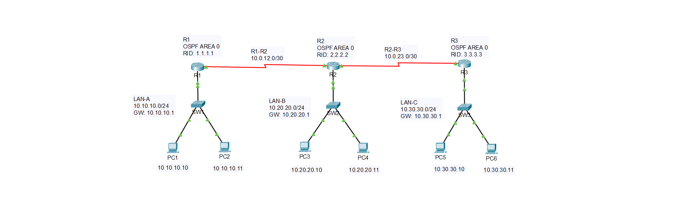
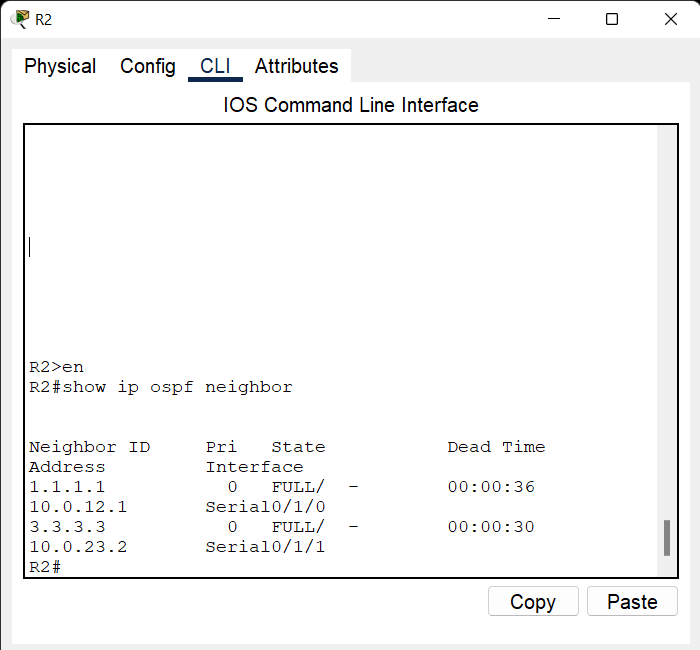
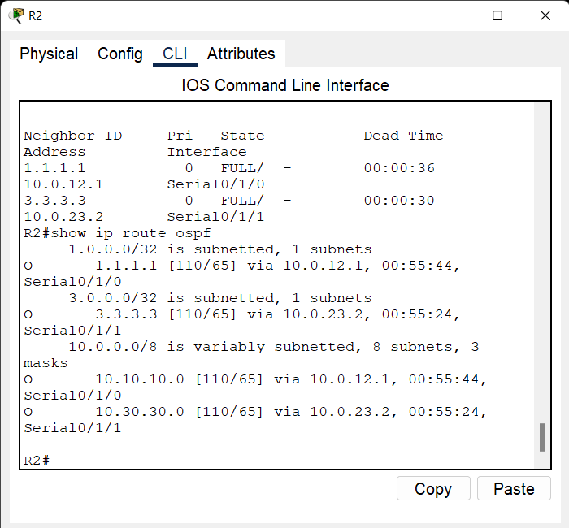
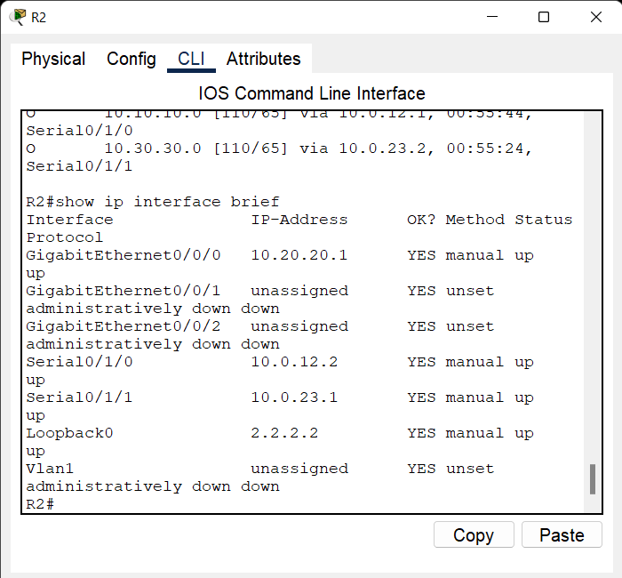
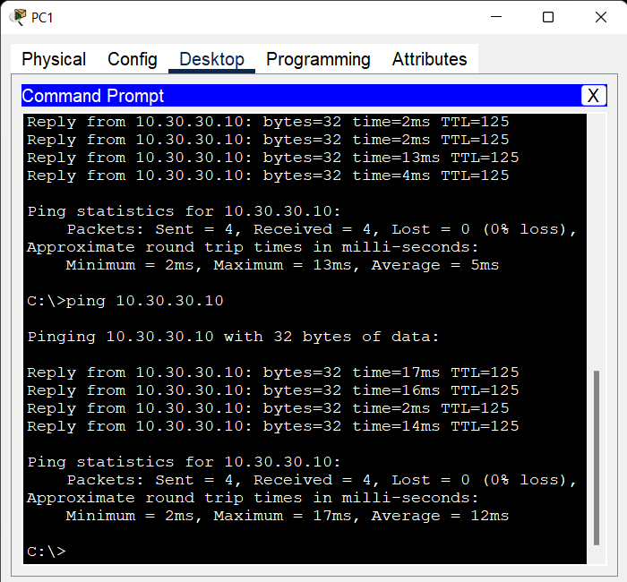

# OSPF Single Area Lab

## 📌 Overview

This project demonstrates a multi-router network using OSPF dynamic routing in a single Area 0.

Three Cisco routers are connected through point-to-point Serial links.

Each router provides connectivity to a separate LAN.

## 🛠️ Technologies

- OSPF
- OSPF Area 0
- Dynamic Routing
- Loopback Interfaces
- Serial Point-to-Point Links
- Passive Interface
- Routing Table Verification
- ICMP Connectivity Testing
- Cisco IOS
- Cisco Packet Tracer

## 🗺️ Network Topology

The network consists of three Cisco routers connected in a linear topology.




## 🌐 IP Addressing

### R1

- LAN Interface: `10.10.10.1/24`
- Serial Interface: `10.0.12.1/30`
- Loopback0: `1.1.1.1/32`
- OSPF Router ID: `1.1.1.1`

### R2

- LAN Interface: `10.20.20.1/24`
- Serial to R1: `10.0.12.2/30`
- Serial to R3: `10.0.23.1/30`
- Loopback0: `2.2.2.2/32`
- OSPF Router ID: `2.2.2.2`

### R3

- LAN Interface: `10.30.30.1/24`
- Serial Interface: `10.0.23.2/30`
- Loopback0: `3.3.3.3/32`
- OSPF Router ID: `3.3.3.3`

## 💻 End Devices

### LAN-A

- PC1: `10.10.10.10/24`
- PC2: `10.10.10.11/24`
- Gateway: `10.10.10.1`

### LAN-B

- PC3: `10.20.20.10/24`
- PC4: `10.20.20.11/24`
- Gateway: `10.20.20.1`

### LAN-C

- PC5: `10.30.30.10/24`
- PC6: `10.30.30.11/24`
- Gateway: `10.30.30.1`

## 🔄 OSPF Configuration

All routers participate in:

- OSPF Process ID: `10`
- OSPF Area: `0`

Router IDs:

- R1: `1.1.1.1`
- R2: `2.2.2.2`
- R3: `3.3.3.3`

LAN interfaces are configured as passive interfaces.

OSPF is used to dynamically exchange routes between the three routers.

## 🔗 WAN Links

### R1 - R2

- Network: `10.0.12.0/30`
- R1: `10.0.12.1`
- R2: `10.0.12.2`

### R2 - R3

- Network: `10.0.23.0/30`
- R2: `10.0.23.1`
- R3: `10.0.23.2`

## 🧪 Verification

The following commands were used to verify the network:

```text
show ip interface brief
show ip ospf neighbor
show ip route ospf
show ip ospf
```

End-to-end connectivity was tested using ICMP ping between hosts located in different LANs.

Example:

```text
PC1 → 10.30.30.10
```

## 📸 Verification Screenshots

### 01 - OSPF Neighbors



### 02 - OSPF Routes



### 03 - Interface Status



### 04 - End-to-End Connectivity




## 📁 Project Files

- `ospf-single-area.pkt` - Cisco Packet Tracer project
- `topology.png` - Network topology
- `screenshots/` - Verification screenshots
- `README.md` - Project documentation

## 🎯 Lab Objective

The objective of this lab is to demonstrate practical knowledge of OSPF single-area design, dynamic routing, point-to-point connectivity, Router ID configuration, routing table verification, and end-to-end network connectivity.

## ✅ Verification Summary

- OSPF neighbor relationships established
- OSPF routes successfully learned
- Serial links operational
- LAN interfaces operational
- End-to-end connectivity verified
- Routing between all three LANs confirmed