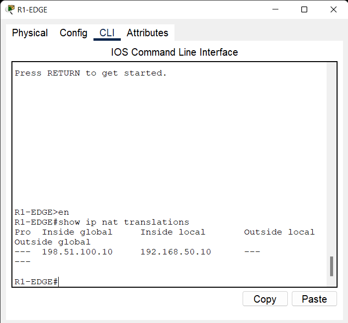
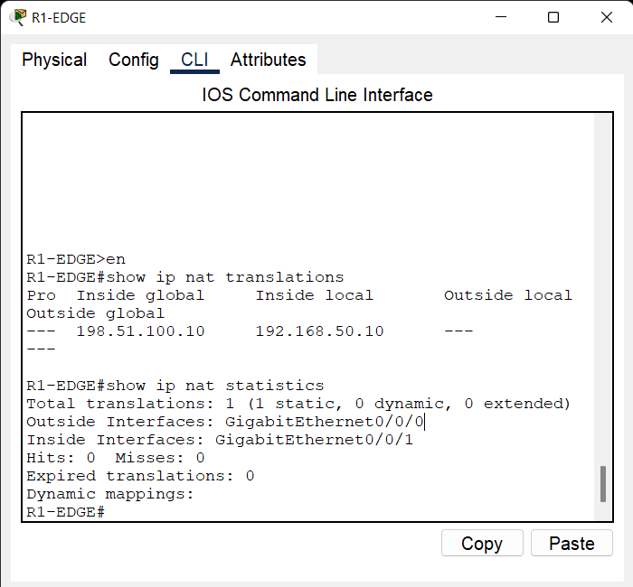
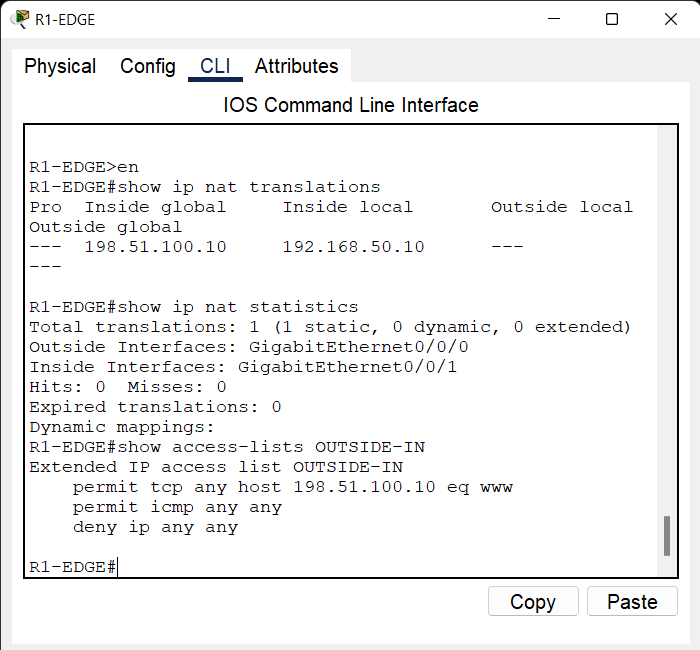
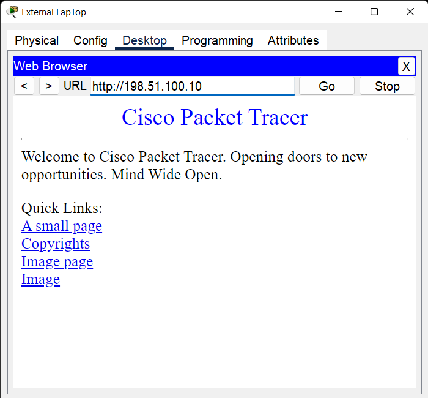

# 04 - NAT + PAT + ACL Edge Network Lab

## 📌 Overview

This project demonstrates an enterprise-style network edge using Cisco NAT, PAT, Static NAT, and Extended ACL.

The topology consists of an internal LAN, an edge router, an ISP router, an internal Web Server, internal clients, and an external client network.

R1-EDGE provides connectivity between the internal network and the external network.

## 🛠️ Technologies

- NAT
- PAT
- Static NAT
- Extended ACL
- Default Route
- Cisco IOS
- Cisco Packet Tracer
- Web Server
- Network Edge Routing

## 🗺️ Network Topology

The internal LAN is connected to R1-EDGE through SW1.

R1-EDGE is connected to the ISP using a point-to-point WAN link.

The internal Web Server is published to the external network using Static NAT.

An external PC is used to test inbound access to the public Web Server.


## 🌐 Network Addressing

### ISP to R1-EDGE

- ISP G0/0/0: `203.0.113.1/30`
- R1-EDGE G0/0/0: `203.0.113.2/30`

### Inside LAN

- Network: `192.168.50.0/24`
- Gateway: `192.168.50.1`

### Internal Devices

- PC1: `192.168.50.11/24`
- PC2: `192.168.50.12/24`
- Web Server: `192.168.50.10/24`
- Default Gateway: `192.168.50.1`

### External Network

- ISP G0/0/1: `198.51.101.1/24`
- External PC: `198.51.101.2/24`
- Default Gateway: `198.51.101.1`

### ISP Loopback

- Loopback0: `198.51.100.1/32`

## 🔄 NAT & PAT

PAT is configured on R1-EDGE to translate internal private IP addresses to the public IP address of the outside interface.

Static NAT is configured for the internal Web Server:

`192.168.50.10` → `198.51.100.10`

This allows the Web Server to be accessed from the external network using its public IP address.

## 🔐 Extended ACL

An extended ACL named `OUTSIDE-IN` is applied inbound on the outside interface of R1-EDGE.

The ACL allows:

- HTTP traffic to `198.51.100.10`
- ICMP traffic

All other IP traffic is denied.

## ⚙️ R1-EDGE Interfaces

### Outside Interface

- Interface: `GigabitEthernet0/0/0`
- IP Address: `203.0.113.2/30`
- NAT Role: `outside`
- ACL: `OUTSIDE-IN`

### Inside Interface

- Interface: `GigabitEthernet0/0/1`
- IP Address: `192.168.50.1/24`
- NAT Role: `inside`

## 🌐 SW1

SW1 provides Layer 2 connectivity for the internal LAN.

### VLAN

- VLAN 50 - USERS

### Connections

- G0/1 → R1-EDGE
- Fa0/1 → PC1
- Fa0/2 → PC2
- Fa0/3 → Web Server

## 🖥️ Web Server

The Web Server uses:

- Private IP: `192.168.50.10`
- Public IP: `198.51.100.10`
- Default Gateway: `192.168.50.1`

HTTP service is enabled on the server for external access testing.

## 🧪 Verification

The following commands were used to verify the configuration:

```text
show ip interface brief
show ip route
show ip nat translations
show ip nat statistics
show access-lists OUTSIDE-IN
````

## 🔍 Connectivity Tests

### ISP Connectivity

From R1-EDGE:

```text
ping 203.0.113.1
```

### PAT Test

From an internal PC:

```text
ping 198.51.100.1
```

Then verify translations on R1-EDGE:

```text
show ip nat translations
```

### Static NAT Test

From the External PC:

```text
ping 198.51.100.10
```

### HTTP Test

From the External PC web browser:

```text
http://198.51.100.10
```

Successful access confirms that the Static NAT and inbound ACL rules are functioning as intended.

## 📸 Verification Screenshots


### 01 - NAT Translations



### 02 - NAT Statistics



### 03 - ACL



### 04 - Static NAT HTTP Test



## 📁 Project Files

* `nat-pat-acl-edge.pkt` - Cisco Packet Tracer project
* `topology.png` - Network topology
* `screenshots/` - Verification screenshots
* `README.md` - Project documentation

## 🎯 Lab Objective

The objective of this lab is to demonstrate practical knowledge of network edge design, NAT, PAT, Static NAT, Extended ACLs, default routing, and controlled access to internal services.

## ✅ Verification Summary

* ISP connectivity verified
* Default route verified
* PAT functionality verified
* Static NAT verified
* Extended ACL verified
* Web Server published through Static NAT
* External HTTP access tested


