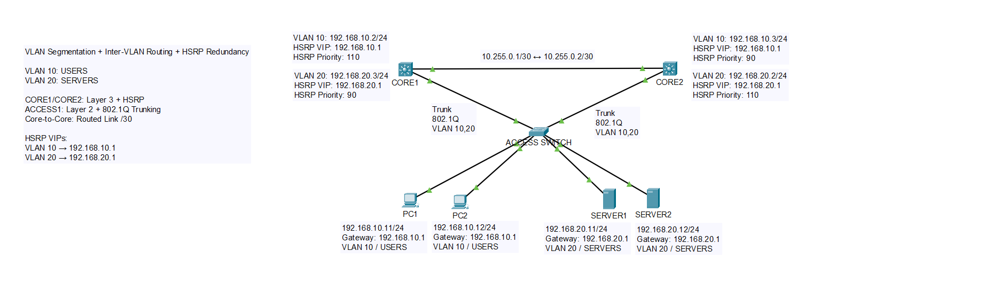
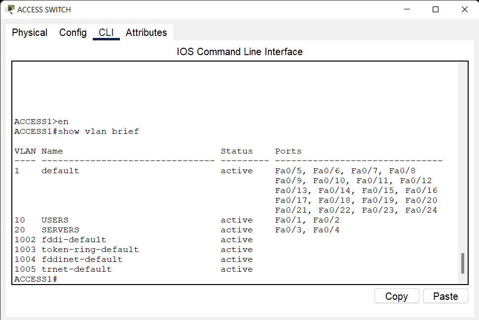
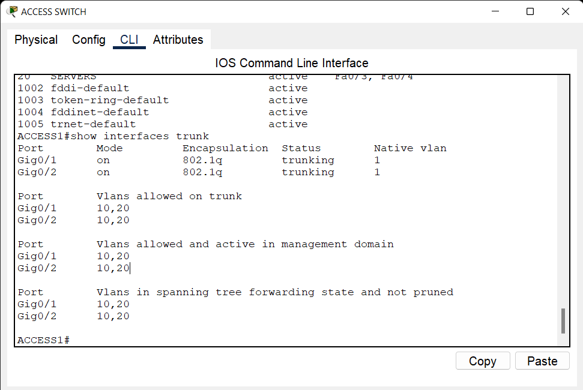
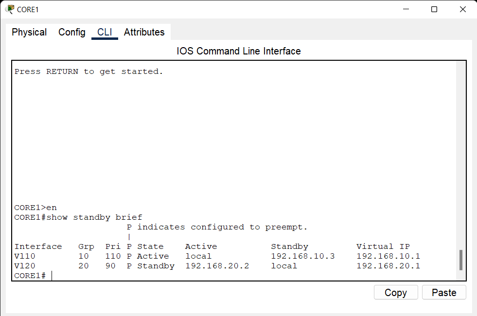
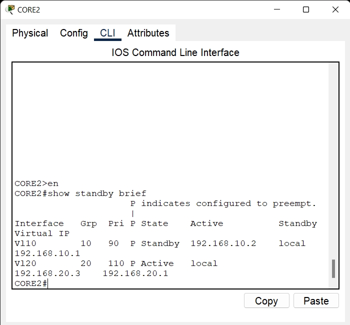
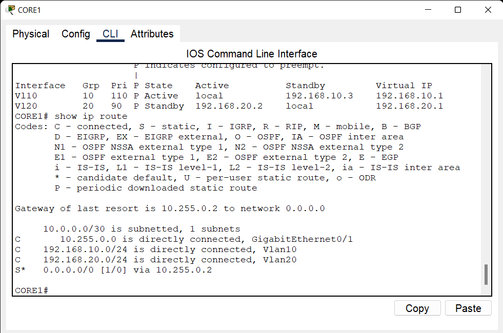
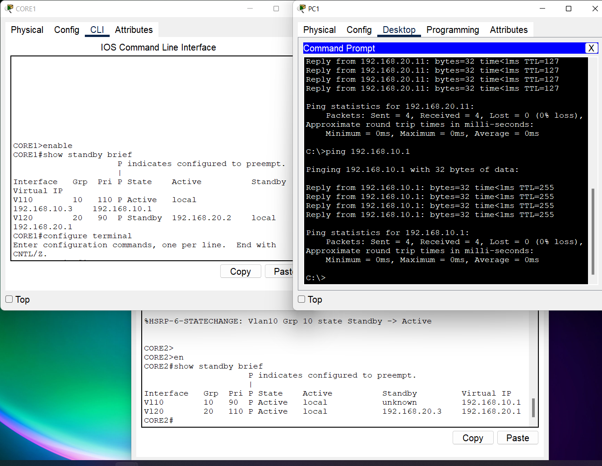
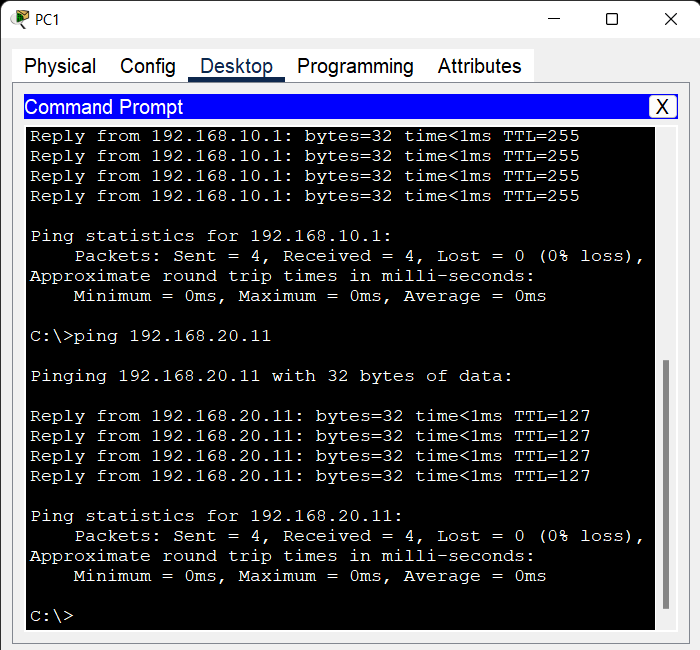

# 05 - HSRP Gateway Redundancy Lab

## 📌 Overview

This project demonstrates first-hop gateway redundancy using HSRP in a multilayer switch environment.

Two Layer 3 core switches provide redundant default gateways for VLAN 10 and VLAN 20.

HSRP is configured with different priorities so that CORE1 is the active gateway for VLAN 10, while CORE2 is the active gateway for VLAN 20.

An access switch provides connectivity for end devices in both VLANs.

## 🛠️ Technologies

- HSRP
- First-Hop Redundancy
- Layer 3 Switching
- Inter-VLAN Routing
- VLAN
- 802.1Q Trunking
- Static Routing
- Spanning Tree PortFast
- Cisco IOS
- Cisco Packet Tracer

## 🗺️ Network Topology

The topology consists of two Layer 3 core switches and one access switch.

ACCESS1 is connected to both CORE1 and CORE2 using trunk links.

CORE1 and CORE2 are connected using a Layer 3 point-to-point link.

HSRP provides a virtual default gateway for the end devices.



## 🌐 VLAN & IP Addressing

### VLAN 10 - USERS

- Network: `192.168.10.0/24`
- Virtual Gateway: `192.168.10.1`
- CORE1: `192.168.10.2`
- CORE2: `192.168.10.3`

### VLAN 20 - SERVERS

- Network: `192.168.20.0/24`
- Virtual Gateway: `192.168.20.1`
- CORE1: `192.168.20.3`
- CORE2: `192.168.20.2`

## 🔄 HSRP Configuration

HSRP provides a virtual IP address that is used as the default gateway by end devices.

### VLAN 10

Virtual Gateway:

`192.168.10.1`

CORE1:

- Priority: `110`
- Role: Active

CORE2:

- Priority: `90`
- Role: Standby

### VLAN 20

Virtual Gateway:

`192.168.20.1`

CORE1:

- Priority: `90`
- Role: Standby

CORE2:

- Priority: `110`
- Role: Active

This configuration provides gateway load distribution across the two VLANs.

## 🔗 Core-to-Core Link

CORE1 and CORE2 are connected using a Layer 3 point-to-point link.

### CORE1

- Interface: `GigabitEthernet0/1`
- IP: `10.255.0.1/30`

### CORE2

- Interface: `GigabitEthernet0/1`
- IP: `10.255.0.2/30`

Network:

`10.255.0.0/30`

## 🔀 Access Switch

ACCESS1 provides Layer 2 connectivity for end devices.

### Trunk Links

- G0/1 → CORE1
- G0/2 → CORE2

Allowed VLANs:

- VLAN 10
- VLAN 20

### Access Ports

VLAN 10:

- Fa0/1
- Fa0/2

VLAN 20:

- Fa0/3
- Fa0/4

## 💻 End Devices

### VLAN 10 - USERS

Example:

- PC1
- PC2

Default Gateway:

`192.168.10.1`

### VLAN 20 - SERVERS

Example:

- Server1
- Server2

Default Gateway:

`192.168.20.1`

End devices use the HSRP virtual IP as their default gateway.

## 🧭 Routing

Both core switches use a static default route through the Layer 3 connection.

### CORE1

Default route:

`0.0.0.0/0 → 10.255.0.2`

### CORE2

Default route:

`0.0.0.0/0 → 10.255.0.1`

## 🧪 Verification

The following commands can be used to verify the configuration:

```text
show standby
show standby brief
show vlan brief
show interfaces trunk
show ip interface brief
show ip route
```

## 🔍 HSRP Verification

### CORE1

```text
show standby brief
```

Expected behavior:

- VLAN 10 → Active
- VLAN 20 → Standby

### CORE2

```text
show standby brief
```

Expected behavior:

- VLAN 10 → Standby
- VLAN 20 → Active

## 🔄 Gateway Redundancy Test

HSRP failover can be tested by shutting down the active SVI or the corresponding core switch.

For example, on CORE1:

```text
interface Vlan10
 shutdown
```

CORE2 should then become the active HSRP gateway for VLAN 10.

After testing:

```text
interface Vlan10
 no shutdown
```

The `preempt` configuration allows the higher-priority switch to regain the active role when it becomes available again.

## 📸 Verification Screenshots

### 01 - Access VLANs



### 02 - Access Trunks



### 03 - CORE1 HSRP



### 04 - CORE2 HSRP



### 05 - IP Routing



### 06 - HSRP Failover



### 07 - Ping Tests



## 📁 Project Files

- `hsrp-gateway-redundancy.pkt` - Cisco Packet Tracer project
- `topology.png` - Network topology
- `screenshots/` - Verification screenshots
- `README.md` - Project documentation

## 🎯 Lab Objective

The objective of this lab is to demonstrate practical knowledge of first-hop redundancy using HSRP, Layer 3 switching, VLANs, trunking, inter-VLAN routing, and gateway failover.

The lab also demonstrates how HSRP priorities can be used to distribute the active gateway role across multiple VLANs.

## ✅ Verification Summary

- VLAN configuration verified
- Trunk links verified
- Layer 3 core connectivity verified
- HSRP active/standby roles verified
- Virtual gateways verified
- Inter-VLAN connectivity verified
- Gateway failover tested
- HSRP preemption verified