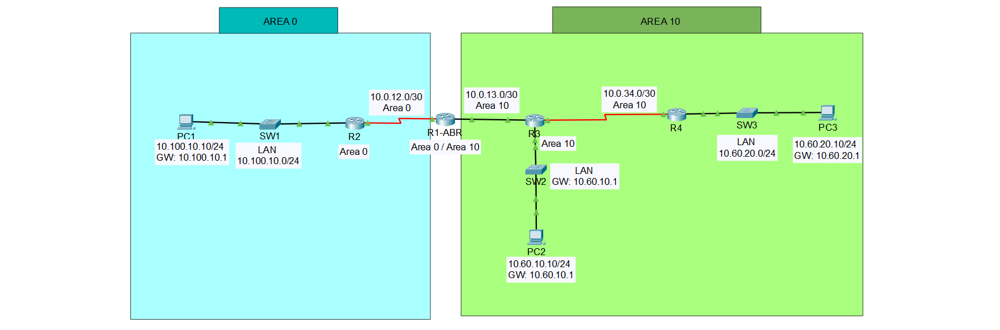
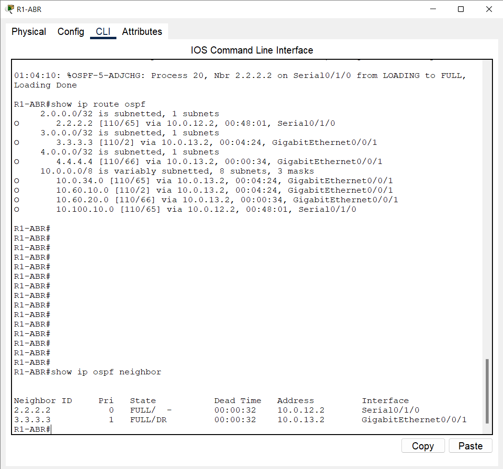
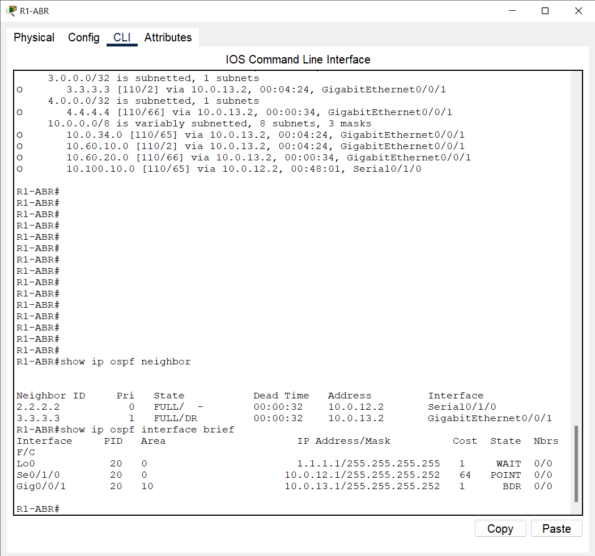
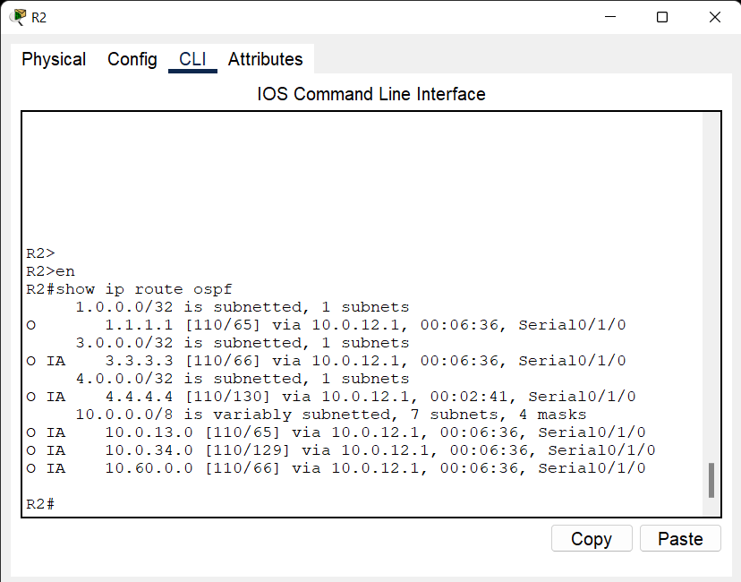
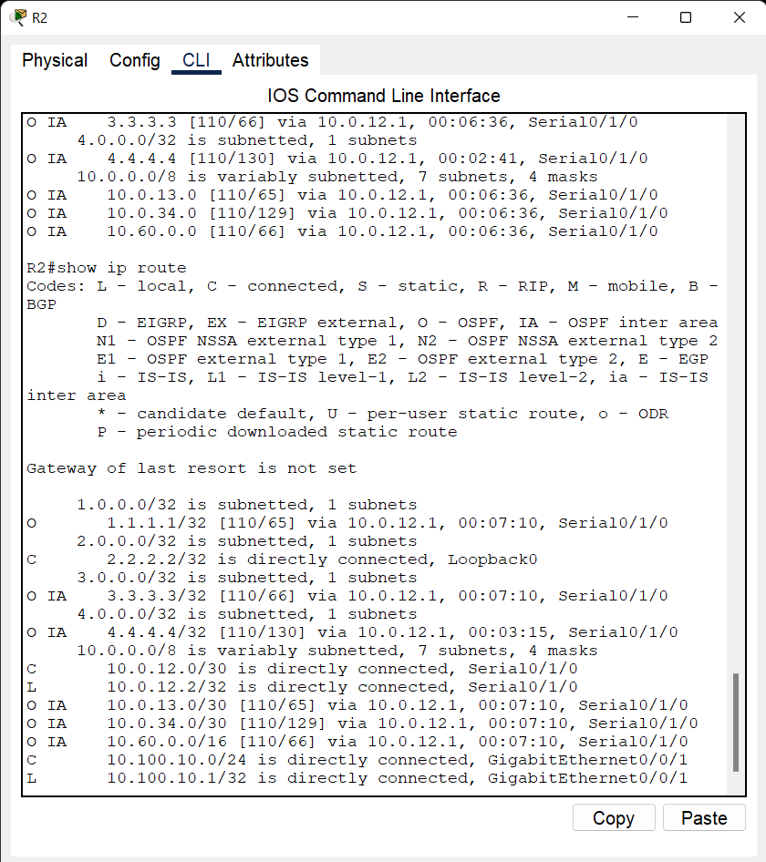
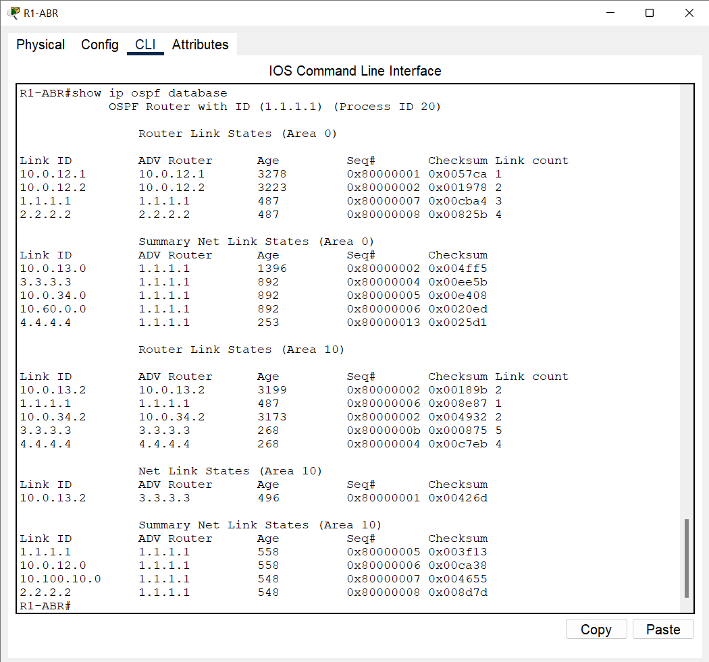
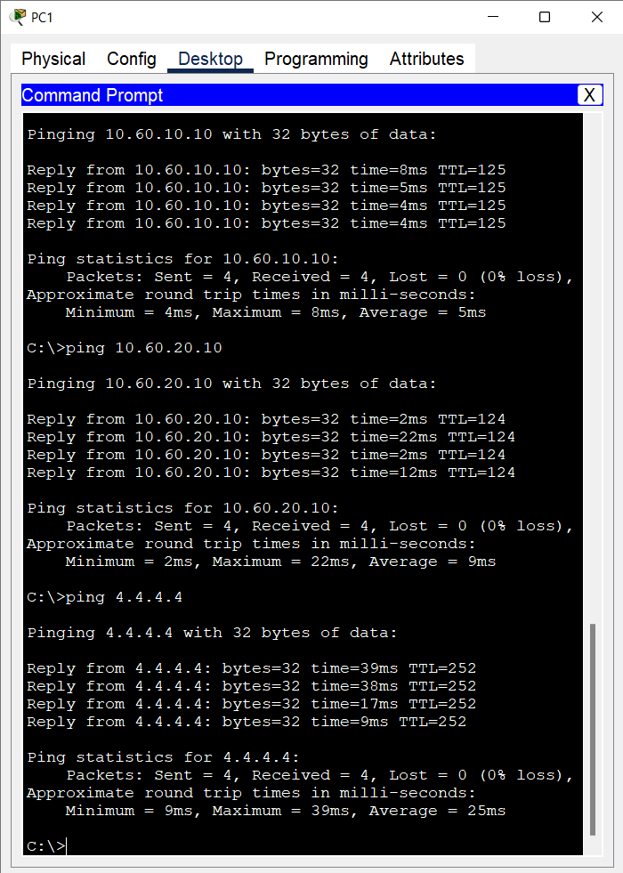

# 06 - OSPF Multi-Area & Route Summarization Lab

## 📌 Overview

This project demonstrates a multi-area OSPF network using Area 0 as the backbone and Area 10 as a separate OSPF area.

R1-ABR acts as the **Area Border Router (ABR)** between Area 0 and Area 10.

Route summarization is configured on the ABR to advertise the Area 10 networks as a summarized `10.60.0.0/16` route.

The lab demonstrates OSPF neighbor formation, inter-area routing, ABR functionality, route summarization, passive interfaces, and end-to-end connectivity between different OSPF areas.

---

## 🛠️ Technologies

* OSPF
* OSPF Multi-Area
* Area 0 Backbone
* Area 10
* Area Border Router (ABR)
* Route Summarization
* Loopback Interfaces
* Passive Interfaces
* Static IP Addressing
* Cisco IOS
* Cisco Packet Tracer

---

## 🗺️ Network Topology

The topology consists of four routers:

* **R1-ABR** connects Area 0 and Area 10 and operates as the Area Border Router.
* **R2** is located in Area 0.
* **R3** and **R4** are located in Area 10.




---

## 🌐 OSPF Areas

### Area 0

Area 0 is the OSPF backbone area.

Contains:

* R1-ABR
* R2

Network:

`10.0.12.0/30`

R2 also provides the LAN:

`10.100.10.0/24`

---

### Area 10

Area 10 contains:

* R1-ABR
* R3
* R4

Networks:

* `10.0.13.0/30`
* `10.0.34.0/30`
* `10.60.10.0/24`
* `10.60.20.0/24`

---

## 🌐 IP Addressing

### R1-ABR

| Interface            | IP Address     | Area    | Purpose        |
| -------------------- | -------------- | ------- | -------------- |
| Serial0/1/0          | `10.0.12.1/30` | Area 0  | TO_R2          |
| GigabitEthernet0/0/1 | `10.0.13.1/30` | Area 10 | TO_R3          |
| Loopback0            | `1.1.1.1/32`   | Area 0  | OSPF Router ID |

> Note: The R1-to-R2 connection uses `Serial0/1/0` in the final topology.

### R2

| Interface            | IP Address       | Area   | Purpose        |
| -------------------- | ---------------- | ------ | -------------- |
| Serial0/1/0          | `10.0.12.2/30`   | Area 0 | TO_R1-ABR      |
| GigabitEthernet0/0/1 | `10.100.10.1/24` | LAN    | TO_SW1         |
| Loopback0            | `2.2.2.2/32`     | Area 0 | OSPF Router ID |

### R3

| Interface            | IP Address      | Area    | Purpose        |
| -------------------- | --------------- | ------- | -------------- |
| GigabitEthernet0/0/0 | `10.0.13.2/30`  | Area 10 | TO_R1-ABR      |
| Serial0/1/0          | `10.0.34.1/30`  | Area 10 | TO_R4          |
| GigabitEthernet0/0/1 | `10.60.10.1/24` | Area 10 | TO_SW2         |
| Loopback0            | `3.3.3.3/32`    | Area 10 | OSPF Router ID |

### R4

| Interface            | IP Address      | Area    | Purpose        |
| -------------------- | --------------- | ------- | -------------- |
| Serial0/1/0          | `10.0.34.2/30`  | Area 10 | TO_R3          |
| GigabitEthernet0/0/1 | `10.60.20.1/24` | Area 10 | TO_SW3         |
| Loopback0            | `4.4.4.4/32`    | Area 10 | OSPF Router ID |

---

## 🔄 OSPF Configuration

OSPF Process ID:

`20`

### Router IDs

| Router | Router ID |
| ------ | --------- |
| R1-ABR | `1.1.1.1` |
| R2     | `2.2.2.2` |
| R3     | `3.3.3.3` |
| R4     | `4.4.4.4` |

---

## 🔗 Area Border Router

R1-ABR connects the two OSPF areas:

```text
Area 0 ←→ R1-ABR ←→ Area 10
```

R1-ABR participates in:

* **Area 0** through `Serial0/1/0`
* **Area 10** through `GigabitEthernet0/0/1`

Therefore, R1-ABR acts as the **Area Border Router (ABR)**.

---

## 📦 Route Summarization

Route summarization is configured on R1-ABR:

```text
router ospf 20
 area 10 range 10.60.0.0 255.255.0.0
```

The Area 10 networks:

```text
10.60.10.0/24
10.60.20.0/24
```

are summarized as:

```text
10.60.0.0/16
```

The summarized route is advertised from Area 10 toward Area 0.

An Area 0 router such as R2 can therefore reach the Area 10 networks through the summary route:

```text
O IA 10.60.0.0/16
```

This reduces the number of specific inter-area routes that need to be advertised.

---

## 🔒 Passive Interfaces

Passive interfaces are used on LAN-facing interfaces where OSPF neighbor formation is not required.

### R2

```text
GigabitEthernet0/0/1
```

R2's LAN interface is passive.

### R3

```text
GigabitEthernet0/0/1
```

R3's LAN interface is passive.

### R4

```text
GigabitEthernet0/0/1
```

R4's LAN interface is passive.

The router can still advertise the connected LAN network into OSPF, but it does not attempt to form OSPF neighbor relationships on the LAN interface.

---

## 💻 End Devices

### Area 0 - PC1

Network:

`10.100.10.0/24`

```text
PC1

IP Address: 10.100.10.10
Subnet Mask: 255.255.255.0
Default Gateway: 10.100.10.1
```

### Area 10 - PC2

Network:

`10.60.10.0/24`

```text
PC2

IP Address: 10.60.10.10
Subnet Mask: 255.255.255.0
Default Gateway: 10.60.10.1
```

### Area 10 - PC3

Network:

`10.60.20.0/24`

```text
PC3

IP Address: 10.60.20.10
Subnet Mask: 255.255.255.0
Default Gateway: 10.60.20.1
```

---

## 🧪 Verification Commands

### OSPF Neighbors

Run on each router:

```text
show ip ospf neighbor
```

Expected OSPF adjacencies:

```text
R1-ABR ↔ R2
R1-ABR ↔ R3
R3 ↔ R4
```

### OSPF Interface Status

```text
show ip ospf interface brief
```

or:

```text
show ip ospf interface
```

### OSPF Database

```text
show ip ospf database
```

### OSPF Routes

```text
show ip route ospf
```

### Full Routing Table

```text
show ip route
```

### OSPF Process Information

```text
show ip protocols
```

---

## 🔍 Route Summarization Verification

### On R1-ABR

Run:

```text
show ip route
```

R1-ABR should have learned the Area 10 networks:

```text
10.60.10.0/24
10.60.20.0/24
```

The configured summary is:

```text
10.60.0.0/16
```

### On R2

Run:

```text
show ip route ospf
```

The Area 0 router should receive the summarized Area 10 route through R1-ABR:

```text
O IA 10.60.0.0/16 via 10.0.12.1
```

This demonstrates inter-area route summarization.

---

## 📡 Connectivity Tests

### From PC1

Test connectivity to Area 10:

```text
ping 10.60.10.10
ping 10.60.20.10
ping 3.3.3.3
ping 4.4.4.4
```

### From PC2

Test connectivity to Area 0 and R4:

```text
ping 10.100.10.10
ping 2.2.2.2
ping 4.4.4.4
```

### From PC3

Test connectivity to Area 0 and R3:

```text
ping 10.100.10.10
ping 1.1.1.1
ping 3.3.3.3
```

These tests verify end-to-end connectivity between Area 0 and Area 10.

> Note: The first ICMP packet may occasionally time out in Packet Tracer because of initial ARP resolution. Subsequent packets should succeed when routing and connectivity are correctly configured.

---

## 📸 Verification Screenshots

### 01 - OSPF Neighbors



### 02 - OSPF Interfaces



### 03 - OSPF Routes



### 04 - Route Summarization



### 05 - OSPF Database



### 06 - End-to-End Connectivity



---

## 📁 Project Files

```text
ospf-multi-area-summarization.pkt
topology.png
screenshots/
README.md
```

* `ospf-multi-area-summarization.pkt` - Cisco Packet Tracer project
* `topology.png` - Network topology
* `screenshots/` - Verification screenshots
* `README.md` - Project documentation

---

## 🎯 Lab Objective

The objective of this lab is to demonstrate practical knowledge of:

* OSPF multi-area design
* Area 0 backbone operation
* Area 10 configuration
* Area Border Router (ABR) functionality
* Inter-area routing
* Route summarization
* Passive interfaces
* Loopback interfaces
* OSPF neighbor formation
* OSPF route verification
* End-to-end connectivity between different OSPF areas

---

## ✅ Verification Summary

* OSPF neighbor relationships verified
* Area 0 adjacency verified
* Area 10 adjacency verified
* R1-ABR functionality verified
* R3-R4 OSPF adjacency verified
* OSPF routes verified
* Route summarization configured
* `10.60.10.0/24` and `10.60.20.0/24` summarized as `10.60.0.0/16`
* Passive interfaces verified
* Inter-area routing verified
* End-to-end connectivity verified

---

