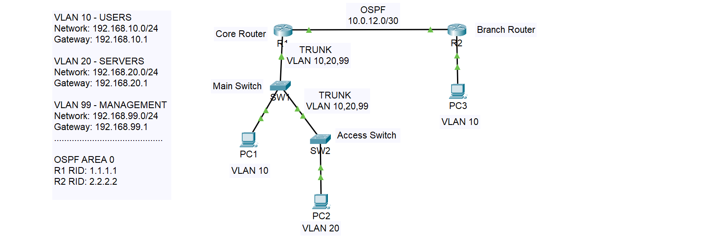
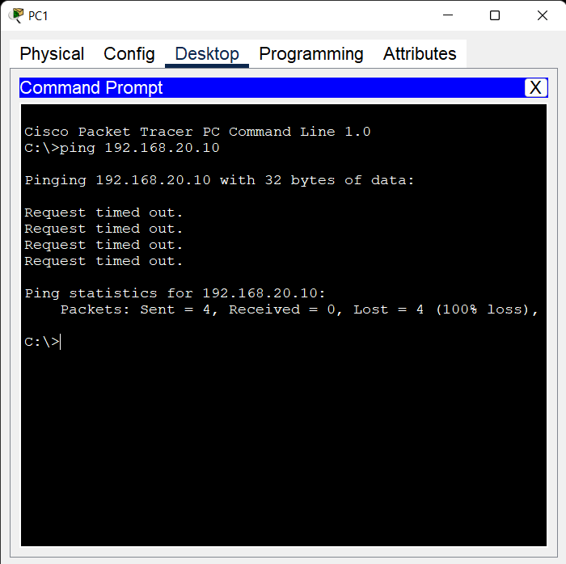
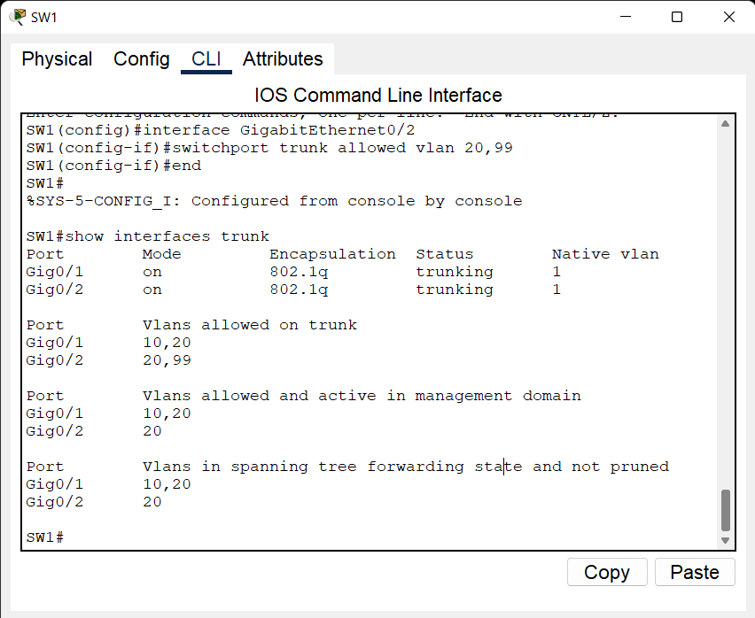
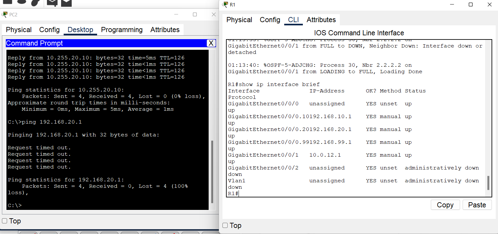
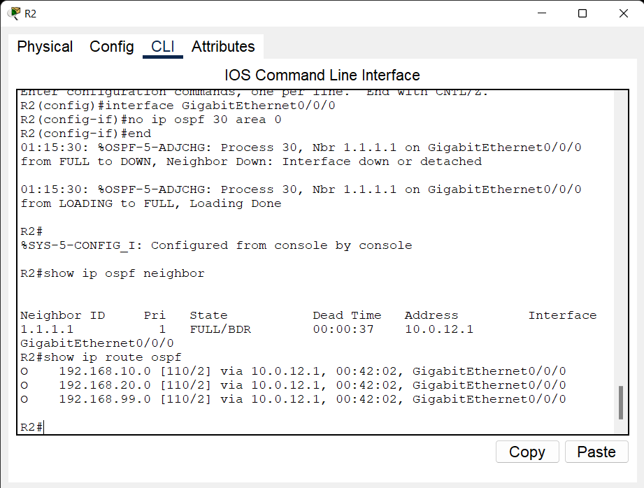
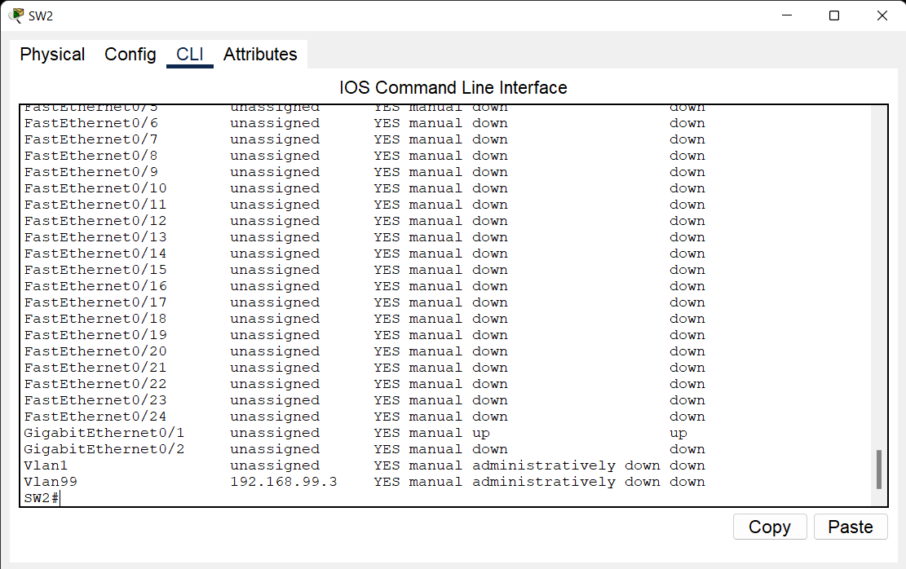
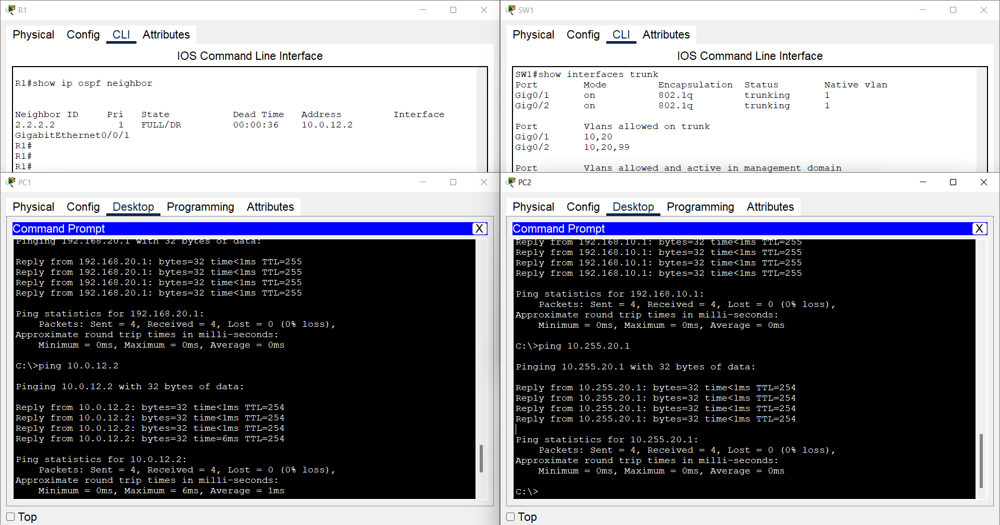

# 07 - Network Troubleshooting Lab

## 📌 Overview

This project demonstrates practical network troubleshooting in a small enterprise-style network.

The lab contains several intentionally introduced configuration issues related to VLANs, trunking, Router-on-a-Stick, OSPF, and management connectivity.

Each problem is identified, diagnosed, corrected, and verified using Cisco IOS commands and end-to-end connectivity tests.

The troubleshooting workflow follows:

**Problem → Diagnosis → Fix → Verification**

---

## 🛠️ Technologies

- VLAN
- 802.1Q Trunking
- Router-on-a-Stick
- Inter-VLAN Routing
- OSPF
- Management VLAN
- Layer 2 Switching
- Layer 3 Routing
- Cisco IOS
- Cisco Packet Tracer
- Network Troubleshooting

---

## 🗺️ Network Topology

The topology consists of two routers and multiple Layer 2 switches.

R1 provides Inter-VLAN Routing using Router-on-a-Stick.

R1 and R2 are connected using an OSPF-enabled Layer 3 point-to-point link.

SW1 and SW2 provide Layer 2 connectivity for the end devices.

VLAN 99 is used as a management VLAN for switch management.



---

## 🌐 Network Addressing

### VLAN 10 - USERS

| Parameter | Value |
| --------- | ----- |
| Network | `192.168.10.0/24` |
| Gateway | `192.168.10.1` |

### VLAN 20 - SERVERS

| Parameter | Value |
| --------- | ----- |
| Network | `192.168.20.0/24` |
| Gateway | `192.168.20.1` |

### VLAN 99 - MANAGEMENT

| Parameter | Value |
| --------- | ----- |
| Network | `192.168.99.0/24` |
| SW2 Management IP | `192.168.99.3` |
| Gateway | `192.168.99.1` |

### R1 - R2 Link

| Router | Interface | IP Address |
| ------ | --------- | ---------- |
| R1 | `GigabitEthernet0/0/1` | `10.0.12.1/30` |
| R2 | `GigabitEthernet0/0/0` | `10.0.12.2/30` |

Network:

`10.0.12.0/30`

### R2 LAN

| Parameter | Value |
| --------- | ----- |
| Network | `10.255.20.0/24` |
| Gateway | `10.255.20.1` |

---

## 🔀 Router-on-a-Stick

R1 provides Inter-VLAN Routing for VLAN 10, VLAN 20, and the management VLAN using 802.1Q subinterfaces.

### R1

| Interface | VLAN | IP Address |
| --------- | ---- | ---------- |
| `G0/0/0.10` | 10 | `192.168.10.1/24` |
| `G0/0/0.20` | 20 | `192.168.20.1/24` |
| `G0/0/0.99` | 99 | `192.168.99.1/24` |

The physical interface `G0/0/0` is connected to SW1 using an 802.1Q trunk.

---

## 🧭 OSPF

OSPF is used to provide dynamic routing between R1 and R2.

### OSPF Process

`30`

### Router IDs

| Router | Router ID |
| ------ | --------- |
| R1 | `1.1.1.1` |
| R2 | `2.2.2.2` |

### OSPF Area

`Area 0`

### R1

R1 advertises:

- `192.168.10.0/24`
- `192.168.20.0/24`
- `192.168.99.0/24`
- `10.0.12.0/30`

### R2

R2 advertises:

- `10.0.12.0/30`
- `10.255.20.0/24`

---

## 🔗 Switch Connectivity

### SW1

SW1 provides connectivity between R1 and the downstream switches.

#### Trunk to R1

Interface:

```text
GigabitEthernet0/1
````

Allowed VLANs:

```text
10,20,99
```

#### Trunk to SW2

Interface:

```text
GigabitEthernet0/2
```

Allowed VLANs:

```text
10,20,99
```

#### Access Port

Interface:

```text
FastEthernet0/1
```

Assigned VLAN:

```text
VLAN 10
```

---

## 🔗 SW2

SW2 provides Layer 2 connectivity for VLAN 20 and management access.

### Uplink

Interface:

```text
GigabitEthernet0/1
```

Connected to:

```text
SW1
```

Allowed VLANs:

```text
10,20,99
```

### Access Port

Interface:

```text
FastEthernet0/1
```

Assigned VLAN:

```text
VLAN 20
```

### Management SVI

```text
Interface Vlan99
IP Address: 192.168.99.3/24
```

---

## 🧪 Troubleshooting Scenarios

The lab includes several intentionally introduced configuration problems.

The purpose is to simulate common network troubleshooting situations and follow a structured troubleshooting methodology.

---

### 01 - Initial Connectivity Failure

The first step is to test end-to-end connectivity before making any configuration changes.

Example:

```text
ping <destination-ip>
```

The initial failure is documented before troubleshooting begins.

---

### 02 - Trunk Troubleshooting

A VLAN is intentionally removed from the allowed VLAN list on a trunk.

Example:

```text
SW1
GigabitEthernet0/2
```

Verification command:

```text
show interfaces trunk
```

The allowed VLAN list is inspected to identify the missing VLAN.

After identifying the problem, the VLAN is restored to the trunk.

Expected configuration:

```text
switchport trunk allowed vlan 10,20,99
```

---

### 03 - Router-on-a-Stick Troubleshooting

An incorrect VLAN ID is intentionally configured on one of the Router-on-a-Stick subinterfaces.

Verification commands:

```text
show ip interface brief
```

and:

```text
show running-config interface GigabitEthernet0/0/0.20
```

The configured 802.1Q VLAN ID is compared with the expected VLAN.

The incorrect configuration is then corrected.

Expected configuration:

```text
interface GigabitEthernet0/0/0.20
 encapsulation dot1Q 20
 ip address 192.168.20.1 255.255.255.0
```

---

### 04 - OSPF Troubleshooting

OSPF is intentionally removed from the R1-R2 interface.

Verification commands:

```text
show ip ospf neighbor
```

and:

```text
show ip route ospf
```

The missing OSPF adjacency and routing information are identified.

OSPF is then restored to the affected interface.

Expected configuration:

```text
interface GigabitEthernet0/0/1
 ip ospf 30 area 0
```

---

### 05 - Management VLAN Troubleshooting

The management SVI on SW2 is checked for operational status and connectivity.

Verification:

```text
show ip interface brief
```

Connectivity test:

```text
ping 192.168.99.1
```

The VLAN, trunk, SVI, and gateway configuration are inspected to identify management connectivity issues.

---

### 06 - Final Connectivity

After all configuration problems have been corrected, end-to-end connectivity is tested again.

The final verification confirms that the network is operating correctly.

Example:

```text
ping 192.168.20.10
ping 10.255.20.1
ping 192.168.99.1
```

---

## 🔍 Verification Commands

### Switch Verification

```text
show vlan brief
show interfaces trunk
show interfaces status
show mac address-table
show spanning-tree
show ip interface brief
```

### Router Verification

```text
show ip interface brief
show ip route
show ip route ospf
show ip ospf neighbor
show ip ospf interface brief
show ip protocols
```

### Connectivity Verification

```text
ping <destination-ip>
traceroute <destination-ip>
```

---

## 🔍 OSPF Verification

### OSPF Neighbor

Run on R1:

```text
show ip ospf neighbor
```

Run on R2:

```text
show ip ospf neighbor
```

Expected adjacency:

```text
R1 ↔ R2
```

### OSPF Routes

```text
show ip route ospf
```

The routers should learn the remote networks through OSPF.

---

## 📡 Connectivity Tests

### From PC1 - VLAN 10

Test the local gateway:

```text
ping 192.168.10.1
```

Test VLAN 20:

```text
ping 192.168.20.1
```

Test R2:

```text
ping 10.0.12.2
```

Test the remote LAN:

```text
ping 10.255.20.1
```

### From a VLAN 20 End Device

Test the local gateway:

```text
ping 192.168.20.1
```

Test VLAN 10:

```text
ping 192.168.10.1
```

Test R2:

```text
ping 10.0.12.2
```

These tests verify Layer 2 connectivity, Inter-VLAN Routing, OSPF routing, and end-to-end reachability.

---

## 📸 Verification Screenshots

### 01 - Initial Failure



Initial connectivity test showing the problem before troubleshooting.

### 02 - Trunk Troubleshooting



Trunk verification showing the VLAN configuration issue.

### 03 - Router-on-a-Stick



Verification of the Router-on-a-Stick configuration.

### 04 - OSPF Troubleshooting



OSPF neighbor and routing verification during troubleshooting.

### 05 - Management VLAN



Management VLAN and SVI verification.

### 06 - Final Connectivity



Successful end-to-end connectivity after all configuration issues were resolved.

---

## 📁 Project Files

```text
07-troubleshooting-lab/
│
├── README.md
├── troubleshooting-lab.pkt
├── topology.png
│
└── screenshots/
    ├── 01-initial-failure.png
    ├── 02-trunk-troubleshooting.png
    ├── 03-router-on-a-stick.png
    ├── 04-ospf-troubleshooting.png
    ├── 05-management-vlan.png
    └── 06-final-connectivity.png
```

* `troubleshooting-lab.pkt` - Cisco Packet Tracer project
* `topology.png` - Network topology
* `screenshots/` - Troubleshooting and verification screenshots
* `README.md` - Project documentation

---

## 🎯 Lab Objective

The objective of this lab is to demonstrate practical network troubleshooting skills using a structured troubleshooting methodology.

The lab focuses on identifying and resolving common issues related to:

* VLAN configuration
* 802.1Q trunking
* Router-on-a-Stick
* Inter-VLAN Routing
* OSPF adjacency
* Dynamic routing
* Management VLAN connectivity
* End-to-end network connectivity

---

## 📚 Troubleshooting Methodology

The troubleshooting process used in this lab follows a structured approach:

```text
1. Identify the problem
2. Verify the symptoms
3. Check the relevant configuration
4. Isolate the faulty component
5. Apply the correction
6. Verify the fix
7. Perform end-to-end testing
```

This approach helps isolate network problems systematically instead of making random configuration changes.

---

## ✅ Verification Summary

* VLAN configuration verified
* Trunk configuration verified
* Router-on-a-Stick verified
* Inter-VLAN routing verified
* OSPF adjacency verified
* OSPF routes verified
* Management VLAN verified
* End-to-end connectivity verified
* Troubleshooting issues identified and resolved
* Final network connectivity verified

---

This lab is intended for educational and demonstration purposes and was built using Cisco Packet Tracer.


